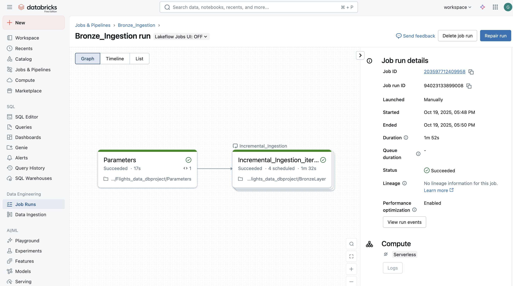

# Incremental Bronze Ingestion using Databricks Auto Loader (Unity Catalog + Volumes)

## 🔍 Overview
This mini data engineering project demonstrates how to implement incremental ingestion into the Bronze layer using **Databricks Auto Loader** with a **Unity Catalog + Volumes architecture**.

Instead of using legacy mounts or ADLS paths, this project uses **Databricks Volumes (Unity Catalog-managed storage)** to ingest CSV files from a **Raw volume** into a **Bronze Delta-managed volume**, while Auto Loader maintains **checkpoint tracking** to ensure only new files are processed without duplicates.

The ingestion pipeline is orchestrated using **Databricks Workflows**, with a **Parameters notebook dynamically passing raw source folder paths** into the ingestion notebook using a **For Each execution pattern**.

---

## ✅ Core Concepts Demonstrated

- Unity Catalog + Volumes-based ingestion (modern Lakehouse governance)
- Auto Loader for schema-aware incremental ingestion
- Checkpointing for stateful ingestion without duplicates
- Delta Table in Bronze Volume automatically optimized & versioned
- Workflow orchestration using Parameter passing + ForEach task pattern

---

## 📸 Visual Walkthrough

### 1️⃣ Raw Volume — Unity Catalog Source Files
`/rawvolume`

> CSV files stored inside Unity Catalog-managed Raw Volume.

---

### 2️⃣ Raw Airports Files with Incremental New File

> Source files for **airports** including a new incoming file to trigger incremental load.

---

### 3️⃣ Raw Bookings Files with Incremental New File

> Source files for **bookings** with additional files for ingestion.

---

### 4️⃣ Raw Customers Files with Incremental New File

> Source files for **customers** stored under Raw Volume.

---

### 5️⃣ Raw Flights Files with Incremental New File

> Source files for **flights** demonstrating multiple incremental ingestion runs.

---

### 6️⃣ Workflow Orchestration — Databricks Job Flow

> Databricks Workflow triggers **Parameters ➜ Bronze Ingestion** using a chained task execution.

---

### 7️⃣ Workflow Task — Parameter Notebook Configuration

> Parameters notebook generates dynamic source paths for ingestion.

---

### 8️⃣ Workflow Task — Bronze Ingestion Notebook Configuration

> Task configured to read dynamic values and run Auto Loader ingestion.

---

### 9️⃣ Workflow For Each Execution Pattern

> Workflow automatically iterates per folder using For Each pattern with `{{tasks.Parameters.values.output_key}}`.

---

### 🔟 Bronze Volume — Data Written as Delta

> Unity Catalog Bronze Volume showing folders created per source.

---

### 1️⃣1️⃣ Checkpoint + Data Directory in Bronze Volume

> Auto Loader maintains checkpoint metadata to ensure only **new files** are processed.

---

### 1️⃣2️⃣ Delta Log View — Managed Bronze Table

> `_delta_log` and parquet files confirming successful Delta ingestion under Unity Catalog governance.

---
